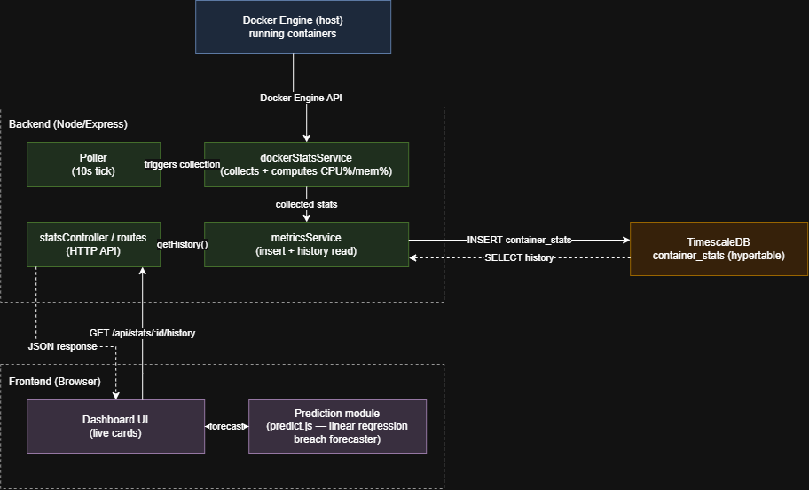

# foresight
Real-time system monitoring that predicts issues before they happen, with plain-language explanations and cost-impact estimates.

## PROJECT NAME - FORESIGHT

## OVERVIEW
Foresight monitors CPU, memory, and error rates across containerized services and tries to catch problems before they actually happen. Instead of waiting for a threshold to be crossed, it looks at where the numbers are heading and sends an alert while there's still time to act. Each alert comes with a plain-language reason for why it fired, plus a rough cost comparison - for example restarting the affected service right away versus upgrading its resources to handle the load.

## PROBLEM IT SOLVES
Most monitoring tools tell you what's happening right now, not what's about to happen. Prometheus, Netdata, and even parts of commercial platforms like Datadog mainly report system health as it stands, and alerts usually fire only after a threshold has already been crossed. By that point a service may already be struggling. Even where prediction features exist, they tend to just show a number or a graph without describing the pattern behind it, and none of them connect a predicted problem to what it would actually cost to deal with. Teams are left interpreting a raw alert on their own and separately weighing whether it's worth spending money to respond.

## TARGET USERS (PERSONAS) 
1. On-Call Engineer — reacts to alerts in the moment, needs to judge severity fast and get a starting idea of the pattern behind it
2. Team Lead / Budget Owner — reviews cost tradeoffs between responding now versus later, doesn't get paged directly
3. Small Team Without Dedicated DevOps — evaluates and sets up the monitoring system themselves since there's no dedicated ops person; cares about it being simple and cheap compared to commercial tools
4. New Team Member — lacks tribal knowledge of what's "normal" for the system, relies on plain-language explanations to understand alerts without prior context
5. System Engineer / Admin — configures which containers are monitored, sets thresholds, manages the monitoring system's own health and settings

## VISION STATEMENT 
Foresight aims to give small teams a monitoring tool that does more than tell them something's wrong. It should catch problems while there's still time to act, explain what pattern triggered the alert, and show what it would cost to respond, so a raw number turns into a decision someone can actually make.

## KEY FEATURES / GOALS
1. Collect live CPU, memory, and error rate data from containerized services at regular intervals
2. Live dashboard showing current values per container
Predict near-future values using trend detection (moving average or slope over recent history)
3. Fire alerts before a configured threshold is predicted to be crossed, not after
4. Group multiple related alerts from one likely root cause into a single alert instead of separate notifications
5. Generate a plain-language explanation for each alert, describing the pattern that triggered it
6. Attach a simulated cost estimate to each alert, comparing at least two response options (e.g. restart now vs. upgrade resources)
7. Store full metric and alert history so past predictions and incidents can be reviewed
8. Let a system admin configure which containers are monitored and set alert thresholds

## SUCCESS METRICS
1. A simulated resource-growth scenario (e.g. a memory leak) is detected and alerted on before the container actually exceeds its configured limit
2. Each fired alert includes a plain-language explanation that correctly describes the pattern that triggered it
3. Each fired alert includes a cost estimate comparing at least two response options
4. Multiple related alerts from one simulated root cause are grouped into a single alert instead of several separate ones
5. The dashboard reflects updated metrics within a few seconds of collection
6. A new team member can look at an alert and understand what's happening without needing to ask someone else first

## ASSUMPTIONS & CONSTRAINTS
1. The system runs against containers on local infrastructure (Docker on a dev machine), standing in for real servers in a production deployment
2. Cost estimates are simulated using public cloud pricing benchmarks applied to each container's configured resource limits, not real billing data
3. Prediction uses simple statistical trend detection (moving average / slope), not machine learning
4. Root-cause alert grouping uses simple rule-based correlation (same time window, related services), not full causal inference
5. Explanations are generated from templates based on the data pattern that triggered a prediction, not a confirmed root cause
6. Scope is limited to what's defined in the MoSCoW breakdown
7. Out of scope for now: real cloud billing integration, ML-based prediction, cross-service causal chains, mobile push notifications
8. Future work: using an LLM to phrase explanations more naturally, while keeping the underlying reasoning based on our own computed data rather than the LLM inferring the cause itself

## BRANCHING STRATEGY
This project follows **GitHub Flow**:
- `main` is always deployable and stable
- All new work happens on a feature branch, named `feature/<short-description>`
- Once work on a branch is complete, open a Pull Request into `main`
- After review, merge the PR and delete the feature branch

Example branches used in this project: `feature/dashboard-ui`, `feature/docker-setup`, `feature/prediction-worker`

## QUICK START - LOCAL DEVELOPMENT

1. Install [Docker Desktop](https://www.docker.com/products/docker-desktop/) and make sure it's running
2. Clone this repository:
   \`\`\`bash
   git clone https://github.com/pranitavivekanandan/foresight.git
   cd foresight
   \`\`\`
3. Build and run all services:
   \`\`\`bash
   docker-compose up --build
   \`\`\`
4. Once running, open your browser to:
   - Frontend: http://localhost:3000
   - Backend health check: http://localhost:5000/health
5. To stop the containers, press `Ctrl+C` in the terminal, then run:
   \`\`\`bash
   docker-compose down
   \`\`\`

## Local Development Tools

- [Visual Studio Code](https://code.visualstudio.com/) — code editor
- [Docker Desktop](https://www.docker.com/products/docker-desktop/) — container runtime for local development
- [Node.js](https://nodejs.org/) (v20) — JavaScript runtime for frontend and backend
- [Git](https://git-scm.com/) — version control
- [GitHub](https://github.com/) — repository hosting, Issues, and Projects for task tracking

## Software Design

*(Editable source: [docs/design/architecture.drawio](docs/design/architecture.drawio))*

Figma prototype: https://www.figma.com/design/sod30DWYk1LUdfJjrW67BM/Foresight

Foresight is built as a layered pipeline: a backend service collects real CPU/memory stats from the Docker Engine API on a fixed interval and stores them in a TimescaleDB hypertable, a thin Express API serves that history through a fixed JSON contract, and the frontend renders live per-container cards while a separate client-side module (`predict.js`) runs linear regression over the fetched history to forecast threshold breaches. Keeping prediction logic entirely on the frontend keeps the backend simple and stateless — it can evolve independently of how trends are visualized or forecast, and each layer (collection, storage, API, UI, prediction) can be changed without touching the others.